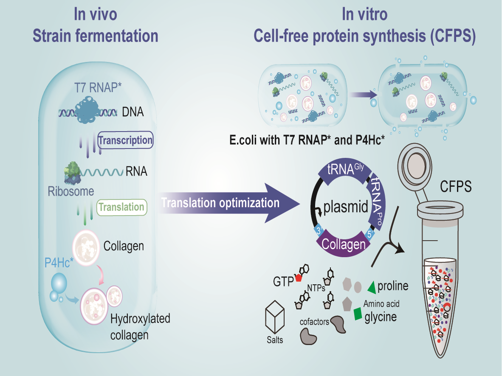

# iDEC 2023 | Tidetron

**Background:**

Collagens, the most abundant proteins in the human body, are involved in complex life processes such as cell state maintenance, cellular immunity, and aging. However, the collagen family has numerous members, complex functions, and repeated protein structures, making it difficult to be screened and biosynthesized. In this study, we systematically analyzed the expression profile, structure and interactome, physiological and pathological function of collagen family and elastin, and discovered a class of collagens with high application value.

**Method:**

To improve the collagen synthetic ability in vivo and vitro, we developed multi-dimensional engineering strategies. 

- In the transcription layer, we optimized the Phage-Assisted Non-Continuous Evolution coupled Atmospheric and Room Temperature Plasma (ARTP-PANCE), a simple and effective directed evolution method to enhance the cleavage ability of Mxe GyrA intein to collagen tripeptide and pIII protein. This was further employed in strengthening the transcriptional processivity of T7 RNA polymerase (T7 RNAP) to collagen gene. 

- In the post-translational modification (PTM) layer, we developed the Fluorescence-Activated Droplet Sorting coupled Targeted Artificial DNA Replisome (TADR-FADS), a high-throughput technique to screen proline hydroxylase by mf-lon and GFP-pdt system.

- Moreover, in the RNA stability and translation layer, we improved the cell-free protein synthesis (CFPS) system using metabolic compensation and self-circularized ribozyme in vitro.

**Results:**
We obtained the T7 RNAP mutant, which possessed 2.3-fold higher performance in CO3A1 gene transcription. We also identified the Moumou_P4Hc mutant with 2.6-fold stronger activity to hydroxylate proline in CO3A1. By integrating these mutant genes into the genome of Escherichia coli BL21 using CRISPR-associated transposon, the yields of CO3A1 and elastin reached 0.013 and 0.047 g/L in vivo, respectively. Further, the cell-free protein synthesis (CFPS) system improvements significantly increased the yield of CO3A1 and elastin to 0.31 and 2.58 g/L, respectively. These results are of great significance for the industrial production and application of collagen.

**Keywords**: Collagens, ARTP-PANCE, TADR-FADS, T7 RNAP, Proline hydroxylase, CFPS, self-circularized ribozyme
  

